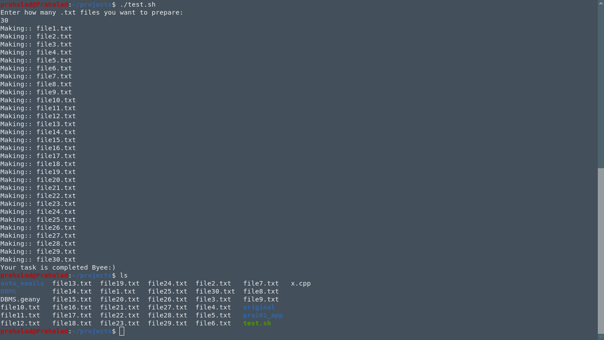

# My_Bash_scripts_linux
These are a set of bash codes, which will enable you to do very tedious works in a very short period of time. 

to make executable chmod +x filename.sh
to run ./filename.sh or bash filename.sh

